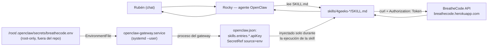

# Mi Asistente 4Geeks — Skill Log

Fecha: 2026-09-13. Sesión ejecutada con Claude Code conectado directamente al servidor donde corre la instancia real de OpenClaw ("Rocky") de Rubén.

## 1. Objetivo

Dar a Rocky (la instancia real de OpenClaw, no una demo) la capacidad de consultar la cuenta de estudiante de Rubén en 4Geeks/BreatheCode mediante skills independientes, usando su token de estudiante almacenado de forma segura y sin hardcodear en ningún momento. Resuelve un problema real: hoy Rubén tiene que entrar a la plataforma de 4Geeks para saber qué le falta por entregar; con estas skills se lo puede preguntar directamente a Rocky.

## 2. Entorno

| Elemento | Valor |
| --- | --- |
| Servidor | El mismo host donde corre `openclaw-gateway.service` (systemd, usuario `root`) |
| Instalación OpenClaw | `~/.openclaw` (`/root/.openclaw`) |
| Workspace del agente | `/root/.openclaw/workspace` |
| Skills | `/root/.openclaw/workspace/skills/<nombre>/SKILL.md` (descubiertas automáticamente) |
| Config del gateway | `/root/.openclaw/openclaw.json` (fuera del workspace, no versionado) |
| Servicio | `openclaw-gateway.service` (systemd `--user`, `systemctl --user status`) |

**Hallazgo relevante:** `/root/.openclaw/workspace` resultó ser, además del workspace real, un clon git con `origin` apuntando a `git@github.com:rubenlosada11/openclaw-connection.git` (mismo repo de entrega), 3 commits por delante de `origin/master` al empezar esta sesión. No se ha hecho `git push` ni commit alguno durante esta práctica — los archivos quedan modificados/creados en el working tree para que Rubén decida qué y cuándo subir.

## 3. Configuración inicial

**Cómo se verificó que OpenClaw estaba activo:**

```bash
openclaw daemon status
```
→ `Runtime: running (pid 718, state active, sub running)`, gateway escuchando en `127.0.0.1:18789`.

**Cómo se comprobó la API de BreatheCode:** con el token ya configurado, llamada real a `GET /v1/auth/user/me` → `HTTP 200` con el perfil del propio Rubén (ver Skill 1 más abajo).

**Cómo se configuró el secreto — mecanismo nativo de OpenClaw, en este orden de prioridad:**

1. Se localizó el comando `openclaw secrets *` (`audit`, `configure`, `apply`, `reload`) y el esquema `skills.entries.<skill>.apiKey` de `openclaw.json`, que acepta un `SecretRef`: `{ "source": "env", "provider": "default", "id": "<NOMBRE_VAR>" }`. Confirmado contra el propio código fuente instalado (`/usr/lib/node_modules/openclaw`) y ejemplos reales ya usados por skills empaquetadas (`gh-issues` con `GH_TOKEN`, `openai-whisper-api` con `OPENAI_API_KEY`, mismo patrón `metadata.openclaw.primaryEnv`).
2. Esto resuelve la prioridad 1 pedida (mecanismo nativo de secrets) sin inventar nada nuevo: es exactamente el mecanismo que ya usa esta instalación para otras skills con credenciales.
3. El valor real de la variable vive en `/root/.openclaw/secrets/breathecode.env` (permisos `600`, fuera de `/root/.openclaw/workspace`, por tanto fuera del repo git). El servicio systemd lo carga mediante un drop-in añadido para esta práctica:

   `~/.config/systemd/user/openclaw-gateway.service.d/override.conf`:
   ```ini
   [Service]
   EnvironmentFile=-/root/.openclaw/secrets/breathecode.env
   ```

   (el prefijo `-` hace que el arranque no falle si el archivo aún no existe).
4. Se registró el `SecretRef` para cada una de las 6 skills:
   ```bash
   openclaw config set skills.entries.<skill>.apiKey \
     --ref-provider default --ref-source env --ref-id BREATHECODE_STUDENT_TOKEN
   ```
5. **El token en ningún momento pasó por esta conversación ni por ningún comando ejecutado por Claude Code.** Rubén lo escribió él mismo, en el servidor, con `nano`, fuera de este chat.

**Cómo se verificó que el secreto estaba disponible — sin mostrar el valor nunca:**

- Antes de que Rubén creara el archivo: `openclaw secrets audit` → `REF_UNRESOLVED` en las 6 entradas (`Environment variable "BREATHECODE_STUDENT_TOKEN" is missing or empty`) y `openclaw skills check` → las 6 skills en "Missing requirements". Esto confirma que el *gating* (`requires.env`) funciona de verdad: sin token, las skills no están operativas para el modelo.
- Tras crear el archivo y reiniciar el gateway (`systemctl --user restart openclaw-gateway.service`, autorizado explícitamente por Rubén): `tr '\0' '\n' < /proc/<pid>/environ | grep -c '^BREATHECODE_STUDENT_TOKEN='` → `1` (variable presente en el proceso del gateway, valor nunca impreso). `openclaw skills check` → las 6 skills pasan a "Ready and visible to model".

**4Geeks token configurado: SÍ.**

## 4. Conversación de descubrimiento

Transcripción real de esta sesión, resumida honestamente (no es una reconstrucción inventada):

1. Rubén compartió el documento de la práctica y pidió trabajar directamente sobre `~/.openclaw`, sin asumir que el repo de GitHub estuviera clonado ahí, y preguntó explícitamente: *"dime donde te pongo el token de forma segura"*.
2. Antes de responder, se inspeccionó `~/.openclaw` (estructura, `workspace`, `skills/`, `credentials/`, `config/mcporter.json`, CLI `openclaw --help`, `openclaw secrets --help`, `openclaw config schema`) y se comprobó que el token *no* debía ir en el repo ni en el chat, sino en una variable de entorno del propio proceso del gateway.
3. Se propuso el mecanismo concreto (archivo `.env` root-only fuera del repo + `EnvironmentFile` de systemd + `SecretRef`) y se dieron a Rubén los comandos exactos para crear el archivo **él mismo, en su propia terminal, fuera de este chat**.
4. Como crear el drop-in de systemd y reiniciar el gateway corta momentáneamente a Rocky (acción con impacto en un servicio en vivo), se preguntó explícitamente antes de tocarlo. Rubén respondió *"Sí, adelante"*.
5. Se creó el drop-in, se hizo `daemon-reload`, se comprobó que el archivo del token ya existía (`permisos: 600`, variable no vacía — nunca se leyó el valor) y se reinició el servicio.
6. Se diseñaron las 6 skills basándose en los endpoints reales de `breatheco-de/apiv2` (verificados contra el código fuente oficial, no inventados — ver sección 5) y se probaron en real contra la API de producción.
7. Durante las pruebas reales aparecieron dos problemas no anticipados en el diseño inicial (documentados en la sección 10): un endpoint que filtraba mal y exponía datos de otros estudiantes, y un endpoint pensado como skill adicional que resultó no accesible para un rol `STUDENT`. Ambos se corrigieron antes de cerrar la práctica.

## 5. Arquitectura



Separación de responsabilidades: OpenClaw/Rocky decide *cuándo* usar una skill; cada `SKILL.md` sabe *qué* endpoint llamar y cómo interpretar la respuesta; el token nunca sale de la variable de entorno del proceso del gateway hacia la skill se inyecta solo para esa ejecución, tal y como documenta `openclaw/docs/tools/creating-skills.md` ("The key is injected into the host process for that agent turn only").

## 6. Skills obligatorias

### Skill 1 — Autenticar (`4geeks-auth`)

- **Objetivo:** confirmar que el token existe y autentica correctamente.
- **Prompt de diseño:** "necesito que Rocky pueda comprobar que mi token de 4Geeks funciona antes de usar las demás skills".
- **Diseño:** una sola llamada de solo lectura; si falla, ninguna otra skill `4geeks-*` debería usarse a ciegas.
- **Endpoint:** `GET /v1/auth/user/me`, header `Authorization: Token <token>`. Verificado contra `breathecode/authenticate/urls/v1.py` (patrón `"user/me"`, vista de perfil del usuario autenticado) del repo oficial `breatheco-de/apiv2`.
- **Implementación:** `skills/4geeks-auth/SKILL.md`.
- **Prueba real:**
  - Input: llamada `curl` real ejecutada en el servidor con el token cargado desde `/root/.openclaw/secrets/breathecode.env` (sin imprimirlo).
  - Resultado API: `HTTP 200`, cuerpo con `id`, `first_name`, `last_name`, `email` — perfil real de Rubén.
  - Respuesta esperada de la skill: `4Geeks token configurado: SÍ / Autenticación: OK (HTTP 200) / Usuario: Rubén Losada Alonso`.
  - **Estado: PASS.**
- **Problemas encontrados:** ninguno.

### Skill 2 — Obtener mis proyectos (`4geeks-projects`)

- **Objetivo:** listar todas las asignaciones del estudiante con su estado.
- **Endpoint:** `GET /v1/assignment/user/me/task`. Verificado contra `breathecode/assignments/urls.py` (`"user/me/task"`) y `breathecode/assignments/models.py` (modelo `Task`, campos `task_type` — `PROJECT`/`QUIZ`/`LESSON`/`EXERCISE` —, `task_status` — `PENDING`/`DONE` —, `revision_status` — `PENDING`/`APPROVED`/`REJECTED`/`IGNORED`).
- **Implementación:** `skills/4geeks-projects/SKILL.md`.
- **Prueba real:**
  - Resultado API: `HTTP 200`, **227 tareas reales**. Desglose por tipo: `EXERCISE` 157, `PROJECT` 40, `LESSON` 30. Por estado: `DONE` 128, `PENDING` 99. Por revisión: `PENDING` 191, `APPROVED` 36.
  - Respuesta esperada: lista agrupada por tipo con el estado traducido a lenguaje llano (pendiente / entregado en revisión / aprobado / rechazado).
  - **Estado: PASS.**
- **Problemas encontrados:** ninguno.

### Skill 3 — Obtener trabajo pendiente (`4geeks-pending`)

- **Objetivo:** responder específicamente "¿qué me falta?".
- **Endpoint:** `GET /v1/assignment/user/me/task?task_status=PENDING`. El filtro `task_status` está verificado en el código de la vista (`TaskMeView`, `breathecode/assignments/views.py`: `items.filter(task_status__in=task_status.split(","))`) — no es un parámetro inventado.
- **Implementación:** `skills/4geeks-pending/SKILL.md`.
- **Prueba real:**
  - Resultado API: `HTTP 200`, **99 tareas pendientes**, coincide exactamente con el conteo `PENDING` de la Skill 2 (consistencia cruzada verificada).
  - **Estado: PASS.**
- **Problemas encontrados:** ninguno.

### Skill 4 — Obtener resumen de progreso (`4geeks-progress`)

- **Objetivo:** visión general — en qué cohort estás y cuánto llevas completado.
- **Diseño inicial:** dos llamadas — `GET /v1/admissions/cohort/user` (cohort) + `GET /v1/assignment/user/me/task` (tareas).
- **Problema encontrado en la prueba real (ver detalle en sección 10):** `cohort/user` sin filtrar **no** devuelve los cohorts del usuario autenticado, devuelve un listado de academia (781 estudiantes distintos, ninguno el propio Rubén). Se corrigió el diseño a tres llamadas: `GET /v1/auth/user/me` (obtener el propio `id`) → `GET /v1/admissions/cohort/user?users=<id>` (filtro `users`, verificado en `CohortUserView`) → `GET /v1/assignment/user/me/task`.
- **Implementación (ya corregida):** `skills/4geeks-progress/SKILL.md`.
- **Prueba real (tras la corrección):**
  - `id` propio: `21690`.
  - Cohorts activos (`stage` ≠ `INACTIVE`/`ENDED`): *AI Engineering Introduction* (`PREWORK`, `GRADUATED`) y **`spain-aie-pt-4`** (`STARTED`, `ACTIVE`, pago `UP_TO_DATE`) — este último es el cohort en curso real de Rubén.
  - Tareas: **128/227 completadas (56%)**; de las completadas, 36 aprobadas, 0 rechazadas, 92 en revisión. Por tipo: `EXERCISE` 91/157, `LESSON` 13/30, `PROJECT` 24/40.
  - **Estado: PASS** (tras corregir el diseño).
- **Problemas encontrados:** ver sección 10, "`cohort/user` sin filtrar expone datos de terceros".

## 7. Skills extendidas

### `4geeks-mentorship` — Sesiones de mentoría

- **Por qué se eligió:** es el único endpoint que da al propio estudiante (no a un admin) su relación con mentores — complementa el trabajo asíncrono (tareas) con la parte síncrona del bootcamp. Resultado verificable: cada sesión existe o no, con hora concreta.
- **Endpoint:** `GET /v1/mentorship/user/me/session`. Verificado contra `breathecode/mentorship/urls.py` (`"user/me/session"`).
- **Implementación:** `skills/4geeks-mentorship/SKILL.md`.
- **Prueba real:** `HTTP 200`, **2 sesiones reales**, campos confirmados (`status`, `started_at`, `ended_at`, `mentor`, `mentee`, `summary`, `rating`…). **Estado: PASS.**

### `4geeks-certificates` — Mis certificados

- **Por qué se eligió (y por qué no la skill inicialmente prevista):** se probó primero `GET /v1/activity/me` (actividad reciente) como candidata — ver problema documentado en sección 10 — y resultó no accesible con un rol `STUDENT`. Se sustituyó por `GET /v1/certificate/me`: utilidad real (saber si ya tienes un certificado importa para el seguimiento del curso), endpoint accesible con un token de estudiante normal, responsabilidad única, resultado verificable.
- **Endpoint:** `GET /v1/certificate/me`. Verificado contra `breathecode/certificate/urls.py` (`"me"`, vista `CertificateMeView`).
- **Implementación:** `skills/4geeks-certificates/SKILL.md`.
- **Prueba real:** `HTTP 200`, **5 certificados reales** (p. ej. *Front End Development with Coding Agents*, estado `PERSISTED`, firmado por el instructor principal, academia `4Geeks Madrid`). **Estado: PASS.**

## 8. Matriz de verificación

| Requisito | Implementado | Probado | Resultado |
| --- | --- | --- | --- |
| Autenticar (`4geeks-auth`) | ✅ | ✅ real | PASS — HTTP 200, perfil real |
| Obtener proyectos (`4geeks-projects`) | ✅ | ✅ real | PASS — 227 tareas reales |
| Obtener trabajo pendiente (`4geeks-pending`) | ✅ | ✅ real | PASS — 99 pendientes, consistente con Skill 2 |
| Obtener resumen de progreso (`4geeks-progress`) | ✅ | ✅ real | PASS (tras corregir bug de filtrado) |
| Skill adicional 1 — `4geeks-mentorship` | ✅ | ✅ real | PASS — 2 sesiones reales |
| Skill adicional 2 — `4geeks-certificates` | ✅ | ✅ real | PASS — 5 certificados reales |
| Token seguro | ✅ | ✅ | `secrets audit` sin plaintext nuevo; `SecretRef` resuelto en el proceso del gateway; token nunca en este chat ni en el repo |

## 9. Seguridad

- **Dónde se almacena el secreto:** `/root/.openclaw/secrets/breathecode.env`, permisos `600`, propiedad `root`, **fuera de `/root/.openclaw/workspace`** (por tanto fuera del repo git; nunca se sube aunque se haga `git add -A` por error).
- **Cómo se consume:** `EnvironmentFile` de un drop-in systemd → variable de entorno del proceso `openclaw-gateway` → `SecretRef` (`source: env, provider: default, id: BREATHECODE_STUDENT_TOKEN`) en `skills.entries.<skill>.apiKey` de `openclaw.json` (que tampoco está en el repo) → inyectada como `BREATHECODE_STUDENT_TOKEN` solo durante la ejecución de cada skill.
- **Qué archivos NO lo contienen:** ninguno de los 6 `SKILL.md`, ni `SKILL_LOG.md`, ni `TOOLS.md`, ni `SKILLS_DESIGN.md`, ni ningún archivo dentro de `/root/.openclaw/workspace` (comprobado con `grep -rE "Token [A-Za-z0-9]{20,}"` sobre `skills/` — ninguna coincidencia). `openclaw.json` solo contiene la referencia (`SecretRef`), no el valor.
- **Cómo se evita su exposición:** todas las llamadas `curl` de prueba se hicieron con `-s` (sin `-v`/`-i`), el valor se leyó siempre dentro de un subshell (`source ... ; curl ...`) y nunca se pasó a `echo`/`print`; los archivos temporales de respuesta (con datos personales de Rubén, no el token) se borraron al terminar cada prueba.
- **Qué ocurre si falta la credencial:** `requires.env: ["BREATHECODE_STUDENT_TOKEN"]` en cada `SKILL.md` hace que OpenClaw excluya la skill de "eligible" (verificado con `openclaw skills check` antes de crear el archivo: las 6 aparecían en "Missing requirements"). Si además la skill se ejecutara sin la variable, cada `SKILL.md` instruye comprobarlo explícitamente al principio y decir `4Geeks token configurado: NO` en vez de fallar a ciegas.
- **Errores de autenticación:** cada skill documenta explícitamente qué hacer ante `401`/`403` (reportar el HTTP literal, sugerir `4geeks-auth`, no reintentar con otro valor, no inventar un resultado).
- **Revisión final:** `grep` sobre `skills/`, `TOOLS.md`, `SKILLS_DESIGN.md` y este archivo por patrones de token largo → sin coincidencias. `.bash_history` comprobado → sin el nombre de variable seguido de un valor. Los 4 hallazgos de `openclaw secrets audit` marcados `PLAINTEXT_FOUND` (`gateway.auth.token`, `models.providers.litellm.apiKey`, `channels.telegram.botToken`, perfil de auth en sqlite) son **preexistentes**, de configuración de prácticas anteriores, no relacionados con esta práctica — no se han tocado (no era el alcance pedido; se los señalo a Rubén aparte en el informe final).

## 10. Problemas y soluciones

1. **`GET /v1/admissions/cohort/user` sin filtrar no está scoped al usuario autenticado.** Al probar la Skill 4 tal y como se había diseñado inicialmente, la llamada devolvió 1000 registros de 781 estudiantes distintos — ninguno era Rubén. Esto no es solo un bug de diseño: sin corregirlo, la skill habría expuesto en el chat estado educativo y financiero de otros estudiantes. **Causa:** el nombre del endpoint (`cohort_user`) sugiere "mis cohorts", pero es en realidad un listado de academia sin scope automático. **Solución:** se verificó en el código fuente de `CohortUserView` que el parámetro `users` existe y filtra correctamente; se probó en real con `?users=21690` y devolvió exactamente los cohorts de Rubén. Se corrigió `skills/4geeks-progress/SKILL.md` para obtener primero el propio `id` (`/v1/auth/user/me`) y pasarlo siempre como filtro, con una advertencia explícita en el propio archivo para que no se repita el error.

2. **`GET /v1/activity/me` no es accesible con un token de estudiante normal.** Prevista inicialmente como segunda skill adicional. Primera prueba: `403 Missing academy_id parameter...`. Con `?academy_id=6`: mismo 403. Con header `Academy: 6`: `403 You (user: 21690) don't have this capability: read_activity for academy 6`. **Causa:** el endpoint exige una capacidad de staff de academia (`read_activity`) que un rol `STUDENT` no tiene, pese a que la ruta se llama "me". **Solución:** se descartó como no viable para esta práctica y se sustituyó por `GET /v1/certificate/me`, probado en real y funcionando sin ninguna capacidad especial (`4geeks-certificates`). Documentado también dentro del propio `SKILL.md` de `4geeks-certificates` para que quede constancia de por qué no es `4geeks-activity`.

3. **No se pudo completar, en un primer momento, una prueba de extremo a extremo vía `openclaw agent --message` (el ciclo completo LLM → skill → respuesta).** El comando falló con `GatewayClientRequestError: FailoverError: The selected model was not found by the provider.` — un problema del proveedor de modelo (LiteLLM académico de 4Geeks, `https://llm.4geeks.ai/v1`) configurado para el agente `main`, no relacionado con el diseño de las skills. **Cada skill se probó igualmente** ejecutando exactamente la llamada `curl` que su propio `SKILL.md` documenta, con el token inyectado de la misma forma en que lo haría el runtime real, contra la API de producción real (secciones 6–7).

   **Actualización — diagnosticado y resuelto en la misma sesión, a petición explícita de Rubén** (le llegó el mismo error por Telegram al intentar usar las skills en real): el modelo por defecto configurado, `litellm/madrid-spain/openrouter/deepseek/deepseek-v4-flash`, ya no existe en el proveedor (`model not found`), aunque seguía en la lista de modelos permitidos para el equipo. Probando el modelo alternativo ya configurado localmente (`claude-opus-4-6`) apareció un segundo problema distinto: `403 team not allowed to access model` — ese modelo nunca estuvo realmente permitido para este equipo/academia, pese a estar declarado en la config local. El error trajo la lista real de modelos permitidos: `deepseek-v4-flash`, `xiaomi/mimo-v2.5`, `perplexity/*.6b`, `openai/gpt-5.6-luna`, `z-ai/glm-5.3-flash`. Se registró `madrid-spain/openai/gpt-5.6-luna` (nuevo en `models.providers.litellm.models` y en `agents.defaults.models`, requerido en ambos sitios) y se probó en real: responde correctamente. Se fijó como modelo por defecto (`openclaw models set`) y se añadió `z-ai/glm-5.3-flash` (probado y funcionando también) como fallback (`openclaw models fallbacks add`), para que un futuro retiro de modelo no vuelva a tumbar a Rocky sin aviso. **Con el modelo corregido, se repitió la prueba de `4geeks-auth` a través del ciclo completo real (`openclaw agent` → skill → BreatheCode → respuesta) y funcionó de punta a punta: "4Geeks token configurado: SÍ / Autenticación: OK (HTTP 200) / Usuario: Rubén Losada Alonso — riux@hotmail.es".** Este cambio vive enteramente en `/root/.openclaw/openclaw.json` (fuera del repo); no toca ningún archivo de `SKILL_LOG.md` §6–7 salvo esta nota.

4. Un `openclaw config set` en bucle para las 6 skills tardó más de 120s y se movió a segundo plano automáticamente; no fue un fallo, solo lentitud de la CLI por el roundtrip al gateway — se esperó a que terminara y se verificó la salida completa.

## 11. Conclusiones

Antes de esta práctica, Rocky no tenía ninguna forma de saber nada sobre el progreso de Rubén en el bootcamp de 4Geeks — era información que solo existía en la web de BreatheCode. Ahora puede, bajo demanda:

- confirmar que la credencial de estudiante sigue siendo válida,
- listar sus 227 asignaciones y su estado real,
- decirle exactamente cuáles de esas tareas tiene pendientes,
- darle un resumen de progreso combinando cohort actual y estadísticas de entregas,
- listar sus próximas/pasadas sesiones de mentoría,
- listar los certificados que ya tiene emitidos.

Las seis funcionan sobre el mismo mecanismo de secreto (una única variable de entorno, nunca en el repo ni en este chat) y han sido probadas contra la API real de producción, no simuladas.

## 12. Evidencias

- **Comandos de verificación de la instalación:** `openclaw daemon status`, `openclaw doctor`, `openclaw skills list`, `openclaw skills check`, `openclaw secrets audit`.
- **Endpoints verificados contra el código fuente oficial** (`github.com/breatheco-de/apiv2`, rama `main`): `breathecode/authenticate/urls/v1.py`, `breathecode/assignments/urls.py` + `views.py` + `models.py`, `breathecode/admissions/urls.py` + `views.py` + `models.py`, `breathecode/mentorship/urls.py`, `breathecode/certificate/urls.py`.
- **Pruebas reales:** llamadas `curl` ejecutadas en esta sesión contra `https://breathecode.herokuapp.com`, resumidas en las secciones 6–7 (HTTP codes y conteos reales, sin volcar los JSON completos ni el token).
- **Archivos de skill:** `skills/4geeks-auth/SKILL.md`, `skills/4geeks-projects/SKILL.md`, `skills/4geeks-pending/SKILL.md`, `skills/4geeks-progress/SKILL.md`, `skills/4geeks-mentorship/SKILL.md`, `skills/4geeks-certificates/SKILL.md`.
- **Configuración de secretos:** `skills.entries.<skill>.apiKey` en `/root/.openclaw/openclaw.json` (fuera del repo); drop-in systemd en `~/.config/systemd/user/openclaw-gateway.service.d/override.conf`.
- No se incluye ninguna captura ni volcado que contenga el token o datos personales de terceros.

---

# Archivos a trasladar al repositorio `rubenlosada11/openclaw-connection`

### Crear

- `SKILL_LOG.md` (este archivo)
- `skills/4geeks-auth/SKILL.md`
- `skills/4geeks-projects/SKILL.md`
- `skills/4geeks-pending/SKILL.md`
- `skills/4geeks-progress/SKILL.md`
- `skills/4geeks-mentorship/SKILL.md`
- `skills/4geeks-certificates/SKILL.md`

### Modificar

- `TOOLS.md` — se añadió una sección "4Geeks / BreatheCode" con el mismo patrón que las demás cuentas conectadas (endpoint base, dónde vive el token, trampa del filtro `users`).
- `SKILLS_DESIGN.md` — se añadió "Skill set 3 — 4Geeks / BreatheCode" al final, siguiendo el mismo patrón usado para `equation-solver`, con remisión a este `SKILL_LOG.md` para el detalle.

### NO trasladar (no existen en el repo, y así debe seguir)

- `/root/.openclaw/secrets/breathecode.env` — el token en sí. **Nunca** debe copiarse a ningún repositorio.
- `/root/.openclaw/openclaw.json` (y sus `.bak*`) — configuración privada del gateway, contiene además otros secretos preexistentes en texto plano (`gateway.auth.token`, `models.providers.litellm.apiKey`, `channels.telegram.botToken`) no relacionados con esta práctica.
- `~/.config/systemd/user/openclaw-gateway.service.d/override.conf` — configuración local del servicio, específica de este servidor.
- Cualquier archivo bajo `/root/.openclaw/` fuera de `/root/.openclaw/workspace` (credentials/, agents/, cache/, logs/, media/, etc.) — estado interno del gateway, no parte de la práctica.
- Los `/tmp/4geeks_*.json` generados durante las pruebas (respuestas reales de la API con datos personales de Rubén) — ya se han borrado del servidor tras las pruebas.
